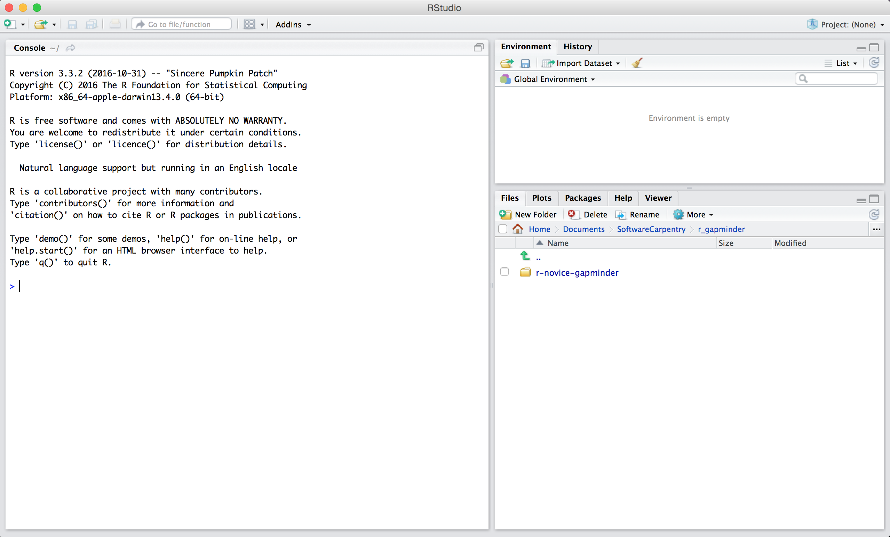

```{r, include=FALSE}
source("../bin/chunk-options.R")
knitr_fig_path("0.01-")
```


## Motivation

Science is a multi-step process: once you've designed an experiment and collected
data, the real fun begins! This lesson will teach you how to start this process using
R and RStudio. We will begin with raw data, perform exploratory analyses, and learn
how to plot results graphically. This example starts with a dataset from
[gapminder.org](https://www.gapminder.org) containing population information for many
countries through time. Can you read the data into R? Can you plot the population for
Senegal? Can you calculate the average income for countries on the continent of Asia?
By the end of these lessons you will be able to do things like plot the populations
for all of these countries in under a minute!

## Before Starting The Workshop

Please ensure you have the latest version of R and RStudio installed on your machine. This is important, as some packages used in the workshop may not install correctly (or at all) if R is not up to date.

* [Download and install the latest version of R here](https://www.r-project.org/)
* [Download and install RStudio here](https://www.rstudio.com/)

## Introduction to RStudio

Welcome to the R portion of the Software Carpentry workshop.

Throughout this lesson, we're going to teach you some of the fundamentals of
the R language as well as some best practices for organizing code for
scientific projects that will make your life easier.

We'll be using RStudio: a free, open source R integrated development
environment. It provides a built in editor, works on all platforms (including
on servers) and provides many advantages such as integration with version
control and project management.


**Basic layout**

When you first open RStudio, you will be greeted by three panels:

  * The interactive R console (entire left)
  * Environment/History (tabbed in upper right)
  * Files/Plots/Packages/Help/Viewer (tabbed in lower right)



Once you open files, such as R scripts, an editor panel will also open
in the top left.


## Work flow within RStudio
There are two main ways one can work within RStudio.

1. Test and play within the interactive R console then copy code into
a .R file to run later.
   *  This works well when doing small tests and initially starting off.
   *  It quickly becomes laborious
2. Start writing in an .R file and use RStudio's short cut keys for the Run command
to push the current line, selected lines or modified lines to the
interactive R console.
   * This is a great way to start; all your code is saved for later
   * You will be able to run the file you create from within RStudio
   or using R's `source()`  function.

> ## Tip: Running segments of your code
>
> RStudio offers you great flexibility in running code from within the editor
> window. There are buttons, menu choices, and keyboard shortcuts. To run the
> current line, you can 
> 1. click on the `Run` button above the editor panel, or 
> 2. select "Run Lines" from the "Code" menu, or 
> 3. hit <kbd>Ctrl</kbd>+<kbd>Return</kbd> in Windows or Linux 
> or <kbd>&#8984;</kbd>+<kbd>Return</kbd> on OS X.
> (This shortcut can also be seen by hovering
> the mouse over the button). To run a block of code, select it and then `Run`.
> If you have modified a line of code within a block of code you have just run,
> there is no need to reselect the section and `Run`, you can use the next button
> along, `Re-run the previous region`. This will run the previous code block
> including the modifications you have made.
{: .callout}

## Introduction to R

Much of your time in R will be spent in the R interactive
console. This is where you will run all of your code, and can be a
useful environment to try out ideas before adding them to an R script
file. This console in RStudio is the same as the one you would get if
you typed in `R` in your command-line environment.

The first thing you will see in the R interactive session is a bunch
of information, followed by a ">" and a blinking cursor. In many ways
this is similar to the shell environment you learned about during the
shell lessons: it operates on the same idea of a "Read, evaluate,
print loop": you type in commands, R tries to execute them, and then
returns a result.

## Other ports of call

* [Quick R](http://www.statmethods.net/)
* [RStudio cheat sheets](http://www.rstudio.com/resources/cheatsheets/)
* [Cookbook for R](http://www.cookbook-r.com/)
