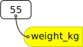

```{r, include = FALSE}
source("../bin/chunk-options.R")
knitr_fig_path("02-starting-with-data-")
```

We are studying inflammation in patients who have been given a new treatment for arthritis,
and need to analyze the first dozen data sets.
The data sets are stored in 
[comma-separated values]({{ page.root }}/reference.html#comma-separated-values-csv) 
(CSV) format. Each row holds the observations for just one patient. Each column holds the 
inflammation measured in a day, so we have a set of values in successive days.
The first few rows of our first file look like this:

```{r echo = FALSE}
tmp <- read.csv("data/inflammation-01.csv", header = FALSE, nrows = 5)
write.table(tmp, quote = FALSE, sep = ",", row.names = FALSE, col.names = FALSE)
rm(tmp)
```

We want to:

* Load data into memory,
* Calculate the average value of inflammation per day across all patients, and
* Plot the results.

To do all that, we'll have to learn a little bit about programming.

### Loading Data

Let's import the file called `inflammation-01.csv` into our R environment. To import the file, first 
we need to tell our computer where the file is. We do that by choosing a working directory, that is, 
a local directory on our computer containing the files we need. This is very important in R. If we 
forget this step we'll get an error message saying that the file does not exist. We can set the 
working directory using the function `setwd`. For this example, we change the path to our new 
directory at the desktop:

```{r, eval = FALSE}
setwd("~/Desktop/r-novice-inflammation/")
```

Just like in the Unix Shell, we type the command and then press <kbd>Return</kbd> (or <kbd>Enter</kbd>).
Also similar to the Unix Shell, we can use tab completion to make it easier to type the working 
directory. So while typing inside the setwd command's quotes, we can press <kbd>Tab</kbd> to list 
possible directories. 
Alternatively we can change the working directory using the RStudio GUI using the menu option 
`Session` -> `Set Working Directory` -> `Choose Directory...`

The data file is located in the directory `data` inside the working directory. Now we can load the 
data into R using `read.csv`:

```{r, results = "hide"}
read.csv(file = "data/inflammation-01.csv", header = FALSE)
```

The expression `read.csv(...)` is a [function call]({{ page.root }}/reference.html#function-call) 
that asks R to run the function `read.csv`.

`read.csv` has two [arguments]({{ page.root }}/reference.html#argument): the name of the file we 
want to read, and whether the first line of the file contains names for the columns of data.
The filename needs to be a character string (or [string]({{ page.root }}/reference.html#string) for 
short), so we put it in quotes. Assigning the second argument, `header`, to be `FALSE` indicates 
that the data file does not have column headers. We'll talk more about the value `FALSE`, and its 
converse `TRUE`, in lesson 04. In case of our `inflammation-01.csv` example, R auto-generates column 
names in the sequence `V1` (for "variable 1"), `V2`, and so on, until `V40`.

> ## Other Options for Reading CSV Files
>
> `read.csv` actually has many more arguments that you may find useful when importing your own data 
> in the future. A good place to find more information about functions, such as `read.csv` is through
> the help files that are part of R. You can use the question mark, `?` preceding the function name
>
> ~~~
> ?read.csv
> ~~~
> {: .language-r}
>
> or use the help function, 
>
> ~~~
> help(read.csv)
> ~~~
> {: .language-r}
>
> This will load up a help page in RStudio (or as plain text in R by itself).
> 
> Each help page is broken down into sections:
> 
>  - Description: An extended description of what the function does.
>  - Usage: The arguments of the function and their default values.
>  - Arguments: An explanation of the data each argument is expecting.
>  - Details: Any important details to be aware of.
>  - Value: The data the function returns.
>  - See Also: Any related functions you might find useful.
>  - Examples: Some examples for how to use the function.
> 
> Different functions might have different sections, but these are the main ones you should be aware of.
{: .callout}

> ## Loading Data with Headers
>
> What happens if you forget to put `header = FALSE`? The default value is
> `header = TRUE`, which you can check using the help functions we just covered.
> What do you expect will happen if you leave the default value?
> Before you run any code, think about what will happen to the first few rows
> of your data frame, and its overall size. Then run the following code and
> see if your expectations agree:
>
> ~~~
> read.csv(file = "data/inflammation-01.csv")
> ~~~
> {: .language-r}
>
> > ## Solution
> > 
> > R will construct column headers from values in your first row of data, 
> > resulting in `X0 X0.1 X1 X3 X1.1 X2 ...`. 
> > 
> > Note that the `X` is prepended just a number would not be a valid variable
> > name. Because that's what column headers are, the same rules apply. 
> > Appending `.1`, `.2` etc. is necessary to avoid duplicate column headers.
> {: .solution}
{: .challenge}

> ## Reading Different Decimal Point Formats
>
> Depending on the country you live in, your standard can use the dot or the comma as decimal mark.
> Also, different devices or software can generate data with different decimal points.
> Take a look at `?read.csv` and write the code to load a file called `commadec.txt` that has 
> numeric values with commas as decimal mark, separated by semicolons.
>
> > ## Solution
> > 
> > ~~~
> > read.csv(file = "data/commadec.txt", sep = ";", dec = ",")
> > ~~~
> > {: .language-r}
> > 
> > or the built-in shortcut:
> > 
> > ~~~
> > read.csv2(file = "data/commadec.txt")
> > ~~~
> > {: .language-r}
> {: .solution}
{: .challenge}

A function will perform its given action on whatever value is passed to the argument(s).
For example, in this case if we provided the name of a different file to the argument `file`, 
`read.csv` would read that instead.
We'll learn more about the details of functions and their arguments in the next lesson.

Since we didn't tell it to do anything else with the function's output, the console will display 
the full contents of the file `inflammation-01.csv`.
Try it out.

`read.csv` reads the file, but we can't use the data unless we assign it to a variable.
We can think of a variable as a container with a name, such as `x`, `current_temperature`, or 
`subject_id` that contains one or more values.
We can create a new variable and assign a value to it using `<-`.

```{r}
weight_kg <- 55
```

Once a variable is created, we can use the variable name to refer to the value it was assigned. 
The variable name now acts as a tag. Whenever R reads that tag (`weight_kg`), it substitutes the 
value (`55`).



To see the value of a variable, we can print it by typing the name of the variable and hitting 
<kbd>Return</kbd> (or <kbd>Enter</kbd>).
In general, R will print to the console any object returned by a function or operation *unless* we 
assign it to a variable.

```{r}
weight_kg
```
We can treat our variable like a regular number, and do arithmetic with it:

```{r}
# conversion for weight, kg to pounds:
2.2 * weight_kg
```


> ## Commenting
>
> We can add comments to our code using the `#` character. It is useful to
> document our code in this way so that others (and us the next time we
> read it) have an easier time following what the code is doing.  
> 
> A good practice to follow is to create self-documenting code. You do this by using
> meaningful variable names, which allows you to use comments to expand the what and the why.
{: .callout}

We can also change a variable's value by assigning it a new value:

```{r}
weight_kg <- 57.5
# weight in kilograms is now
weight_kg
```
> ## Variable Naming Conventions
>
> Historically, R programmers have used a variety of conventions for naming variables. The `.` 
> character
> in R can be a valid part of a variable name; thus the above assignment could have easily been 
> `weight.kg <- 57.5`.
> This is often confusing to R newcomers who have programmed in languages where `.` has a more 
> significant meaning.
> Today, most R programmers 1) start variable names with lower case letters, 2) separate words in 
> variable names with
> underscores, and 3) use only lowercase letters, underscores, and numbers in variable names. The 
> book *R Packages* includes
> a [chapter](http://r-pkgs.had.co.nz/style.html) on this and other style considerations.
{: .callout}


Assigning a new value to a variable breaks the connection with the old value; R forgets that number 
and applies the variable name to the new value. 

When you assign a value to a variable, R only stores the value, not the calculation you used to 
create it. This is an important point if you're used to the way a spreadsheet program automatically 
updates linked cells. Let's look at an example.

First, we'll convert `weight_kg` into pounds, and store the new value in the variable `weight_lb`:

```{r}
weight_lb <- 2.2 * weight_kg
# weight in kg...
weight_kg
# ...and in pounds
weight_lb
```

In words, we're asking R to look up the value we tagged `weight_kg`,
multiply it by 2.2, and tag the result with the name `weight_lb`:


If we now change the value of `weight_kg`:

```{r}
weight_kg <- 100.0
# weight in kg now...
weight_kg
# ...and weight in pounds still
weight_lb
```


Since `weight_lb` doesn't "remember" where its value came from, it isn't automatically updated when 
`weight_kg` changes.
This is different from the way spreadsheets work.

> ## Printing with Parentheses
>
> An alternative way to print the value of a variable is to use
> `(` parentheses `)` around the assignment statement.
> As an example: `(total_weight <- weight_kg*2.2 + weight_lb)` adds the values of `weight_kg` 
> converted to pounds (don't forget to change to the same units) and `weight_lb`,
> assigns the result to the `total_weight`,
> and finally prints the assigned value of the variable `total_weight`.
{: .callout}

Now that we know how to assign things to variables, let's re-run `read.csv` and save its result 
into a variable called 'dat':

```{r}
inflammation <- read.csv(file = "data/inflammation-01.csv", header = FALSE)
```

This statement doesn't produce any output because the assignment doesn't display anything.
If we want to check if our data has been loaded, we can print the variable's value by typing the 
name of the variable `inflammation`. However, for large data sets it is convenient to use the function `head` 
to display only the first few rows of data.


```{r}
head(inflammation)
```

> ## Valid variable names
>
> Which of the following are valid R variable names?
> ```{r, eval=FALSE}
> min_height
> max.height
> _age
> .mass
> MaxLength
> min-length
> 2widths
> celsius2kelvin
> ```
>
> > ## Solution to challenge 1
> >
> > The following can be used as R variables:
> > ```{r ch1pt1-sol, eval=FALSE}
> > min_height
> > max.height
> > MaxLength
> > celsius2kelvin
> > ```
> >
> > The following creates a hidden variable:
> > ```{r ch1pt2-sol, eval=FALSE}
> > .mass
> > ```
> >
> > The following will not be able to be used to create a variable
> > ```{r ch1pt3-sol, eval=FALSE}
> > _age
> > min-length
> > 2widths
> > ```
> {: .solution}
{: .challenge}


> ## Assigning Values to Variables
>
> Draw diagrams showing what variables refer to what values after each statement in the following program:
>
> ~~~
> mass <- 47.5
> age <- 122
> mass <- mass * 2.0
> age <- age - 20
> ~~~
> {: .language-r}
>
> > ## Solution
> >
> > ~~~
> > mass <- 47.5
> > age <- 122
> > ~~~
> > {: .language-r}
> > 
> > 
> >
> > ~~~
> > mass <- mass * 2.0
> > age <- age - 20
> > ~~~
> > {: .language-r}
> > 
> > 
> > 
> {: .solution}
{: .challenge}

### Manipulating Data

Now that our data are loaded into R, we can start doing things with them.
First, let's ask what type of thing `inflammation` is:

```{r}
class(inflammation)
```

The output tells us that it's a data frame. Think of this structure as a spreadsheet in MS Excel 
that many of us are familiar with.
Data frames are very useful for storing data and you will use them frequently when programming in R.
A typical data frame of experimental data contains individual observations in rows and variables in 
columns.

We can see the shape, or [dimensions]({{ page.root }}/reference.html#dimensions-of-an-array), of the 
data frame with the function `dim`:

```{r}
dim(inflammation)
```

This tells us that our data frame, `inflammation`, has `r nrow(inflammation)` rows and 
`r ncol(inflammation)` columns.

If we want to get a single value from the data frame, we can provide an 
[index]({{ page.root }}/reference.html#index) in square brackets. The first number specifies the 
row and the second the column:

```{r selecting data frame elements}
# first value in inflammation, row 1, column 1
inflammation[1, 1]
# middle value in inflammation, row 30, column 20
inflammation[30, 20]
```

> ## R is a 1-index language
>
> I like to think of this as a fight that goes back centuries with mathematicians arguing over
> "what is the first number, zero or one?"  What this looks like in modern times is computer 
> programmers making languages, that are either zero-indexed or one-indexed, meaning, "how do you 
> call the first element of an indexed object?"
> In many programming languages (C and Python, for example), the first
> element of an inxed object is 0. In R, the first element is called using 1.
{: .callout}

The first value in a data frame index is the row, the second value is the column.
If we want to select more than one row or column, we can use the function `c`, which stands for **c**ombine.
For example, to pick columns 10 and 20 from rows 1, 3, and 5, we can do this:

```{r selecting with c}
inflammation[c(1, 3, 5), c(10, 20)]
```

We frequently want to select contiguous rows or columns, or a slice, such as the first ten rows, 
or columns 3 through 7. 
You can use `c` for this, but it's more convenient to use the `:` operator. This special function 
generates sequences of numbers:

```{r sequences}
1:5
3:12
```

For example, we can slice the data to select the first ten columns of values for the first four rows 
like this:

```{r}
inflammation[1:4, 1:10]
```

or the first ten columns of rows 5 to 10 like this:

```{r}
inflammation[5:10, 1:10]
```

If you want to select all rows or all columns, leave that index value empty. 

```{r}
# All columns from row 5
inflammation[5, ]
# All rows from column 16-18
inflammation[, 16:18]
```

If you leave both index values empty (i.e., `inflammation[,]`), you get the entire data frame. 

> ## Addressing Columns by Name
>
> Columns can also be addressed by name, with either the `$` operator (ie. `inflammation$V16`) or square 
> brackets (ie. `inflammation[, 'V16']`).
> You can learn more about subsetting by column name in this supplementary 
> [lesson]({{ page.root }}/10-supp-addressing-data/).
{: .callout}



